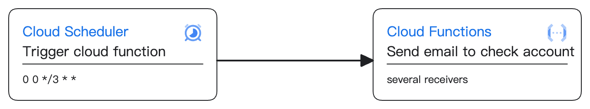

# Email Checker

## Aim: send email periodically to check accounts' accessibility

## Tools:
- Cloud Scheduler: periodically get Cloud Function's API endpoint
- Cloud Functions: expose API endpoint to execute function

## Testing:
- `functions-framework --target send_email --debug`
- `curl localhost:8080`

## Flow:
